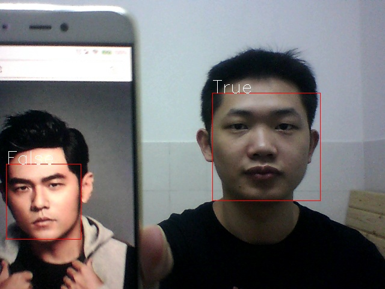

# face_recognition
使用tensorflow进行人脸识别，识别摄像头中的人脸是不是自己

## 准备 ##
* 安装opencv-python、dlib、tensorflow
* 下载lfw人脸数据集：[http://vis-www.cs.umass.edu/lfw/lfw.tgz](http://vis-www.cs.umass.edu/lfw/lfw.tgz)，解压在data文件夹下
* 下载dlib人脸形状检测器模型数据：[http://dlib.net/files/shape_predictor_68_face_landmarks.dat.bz2](http://dlib.net/files/shape_predictor_68_face_landmarks.dat.bz2)，解压在data/models文件夹下

## 步骤 ##
	1. 运行get_my_face_image.py，获取摄像头前的自己的人脸图片，进行人脸对齐，改变对比度亮度增加多样性，并保存图片在data/myself文件夹下，可以间断性获得，一共10000张
	2. 运行get_other_face_image.py，获取lfw数据集中的人脸图片并进行人脸对齐作为负样本，保存图片在data/others文件夹下
	3. 运行cnn_classifier.py，用tensorflow设计cnn模型进行人脸识别，在这里实际上就是二分类，利用data/myself文件夹下的图片和data/others文件夹下的图片进行训练和测试，调整模型和参数，并保存最后的cnn模型在models文件夹下
	4. 运行is_my_face.py，构建和上一步相同的网络模型，加载models下的cnn模型参数，对当前摄像头的人脸进行识别，判断是不是自己，对人脸进行标注

## 效果 ##

